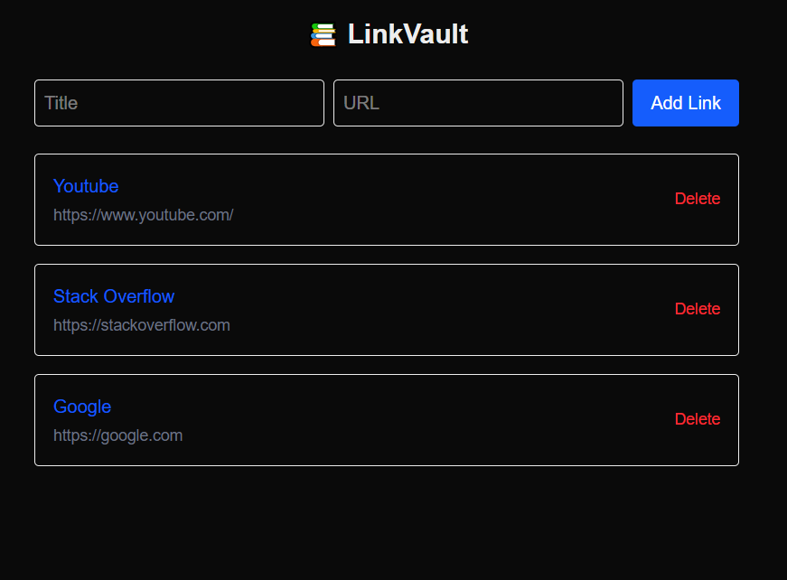

# 📚 LinkVault

LinkVault is a minimal and responsive link-saving web app built with **Next.js**, **TypeScript**, **Tailwind CSS**, and **Supabase**. It allows users to add, view, and delete useful links — perfect for personal bookmarking or project references.

---

## 🚀 Features

- 🔗 Add links with title and URL
- 📋 Display all saved links
- 🗑️ Delete links with confirmation
- 💨 Smooth animations with Framer Motion
- 📱 Fully responsive and mobile-friendly

---

---

## ScreenShot

---

## 🛠️ Tech Stack

- **Frontend:** Next.js, TypeScript, Tailwind CSS
- **Backend:** Supabase (PostgreSQL)
- **Animation:** Framer Motion

---